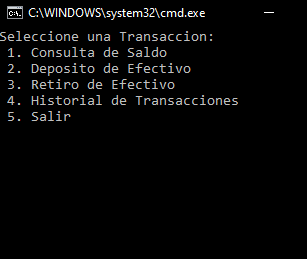
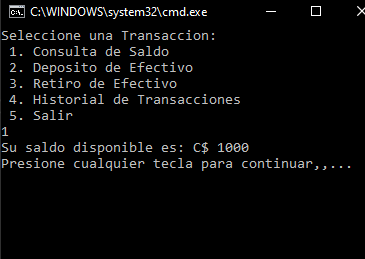
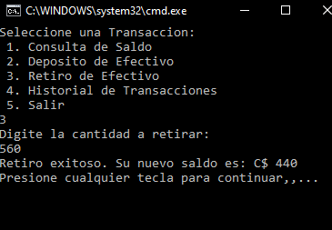
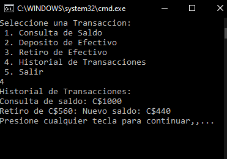
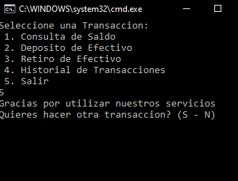

# ATM en Consola - C# .NET

Este proyecto es una simulación de un cajero automático (ATM) desarrollado en C# .NET Framework. La aplicación permite a los usuarios realizar varias transacciones, como consultar el saldo, depositar y retirar efectivo, y revisar su historial de transacciones.

## Funcionalidades

- **Autenticación con PIN:** Los usuarios pueden iniciar sesión utilizando un PIN único.
- **Consulta de Saldo:** Permite a los usuarios consultar el saldo disponible en su cuenta.
- **Depósito de Efectivo:** Los usuarios pueden depositar efectivo en su cuenta con un límite máximo establecido.
- **Retiro de Efectivo:** Permite a los usuarios retirar efectivo, siempre que el saldo sea suficiente.
- **Historial de Transacciones:** Los usuarios pueden revisar un historial de sus transacciones realizadas.
- **Validación de PIN:** El sistema permite tres intentos para ingresar el PIN correcto antes de bloquear la sesión.

## Requisitos

- .NET Framework 4.7.2 o superior
- IDE compatible con C# (Visual Studio recomendado)

## Cómo usar

1. **Compilación:**
   - Clona el repositorio en tu máquina local.
   - Abre el proyecto en Visual Studio.
   - Compila y ejecuta el proyecto.

2. **Iniciar sesión:**
   - Cuando se ejecute la aplicación, se te pedirá que ingreses un PIN. (Puedes usar: 321 o 123)
   - Ingresa el PIN correcto para acceder a las funciones del ATM.

3. **Realizar Transacciones:**
   - Una vez autenticado, sigue las indicaciones en pantalla para realizar diferentes transacciones:
     - Consulta de Saldo
     - Depósito de Efectivo
     - Retiro de Efectivo
     - Revisión del Historial de Transacciones
   - Al finalizar, puedes optar por realizar otra transacción o salir del sistema.

## Ejemplo de Uso

### 1. Pantalla de Menú

### 2. Consulta de Saldo

### 3. Retiro Exitoso

### 4. Historial de Transacciones

### 5. Salir del ATM

## Contribuciones

Este es un proyecto educativo, por lo que las mejoras son bienvenidas. Si encuentras algún problema o tienes sugerencias, siéntete libre de abrir un "issue" o enviar un "pull request".
